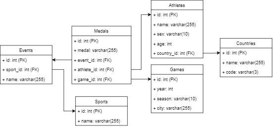

<h1 align="center">

<br>
Olympics API 
</h1>

OlympicsAPI is a RESTful API built on Python, FastAPI and SQLAlchemy that provides historic data on Olympic games. 
It currently provides information on medals, athletes, countries, and events.

## Prerequisites

- Python 3.6+
- FastAPI
- MySQL

## Installation
- Clone the repository 
- Install dependencies with `pip install -r requirements.txt`
- Importing a MySQL Dump File and Creating a Database and User
- If you don't have a database created yet, you'll need to create one before you can import your dump file. 
- To create a new database, use the following command:
```
  mysql -u root -p -e "CREATE DATABASE olympics;"
```
- Next, create a new MySQL user and grant it privileges on your database. To do this, run the following commands:
```
mysql -u root -p -e "CREATE USER 'myuser'@'localhost' IDENTIFIED BY 'mypassword';"
```
```
mysql -u root -p -e "GRANT ALL PRIVILEGES ON olympics.* TO 'myuser'@'localhost';"
```
- Make sure to replace myuser and mypassword with your own username and password.
- Now that you have a database and user created, you can import your dump file. To do this, run the following command:
```
mysql -u myuser -p olympics < olympics.sql
```
- Add your database credentials to `config.yml`
- Run the API with `uvicorn api:app --reload`

### Usage
The API has several endpoints that can be used to retrieve information, including:

- `/athlete`: Returns information on a random athlete chosen from the database.

- `/id/{id}`: Returns information on an Olympic athlete, filtered by ID.

- `/sports`: Returns information on all sports that have been part of the olympics.

- `/events`: Returns information on Olympic events that have been part of the olympics.

The API is designed to be easily extendable, and additional endpoints can be added as needed to provide more information on Olympic games.

## The Process

The dataset used for this project was obtained from [Kaggle](https://www.kaggle.com/datasets/nitishsharma01/olympics-124-years-datasettill-2020).

Due to the size of the dataset and large amounts of redundancy, the data was first cleaned `clean_data.py` to remove 
entries with empty values and names were converted to title case.

The Relationship Database Model (RDBMS) was created using `init_db.py`. The model for this rdbms is shown below:



Once the database was created, the data was imported into the database using `read_data.py`.

The API was built using FastAPI and SQLAlchemy. The API is designed to be easily extendable, and additional endpoints can be added as needed to provide more information on Olympic games.
For now, the API supports only GET requests, but it can be easily extended to support POST, PUT, and DELETE requests.

If I get time, I will add more endpoints to the API to provide more information on Olympic games.

## License

This project is licensed under the MIT License - see the [LICENSE](LICENSE) file for details.
